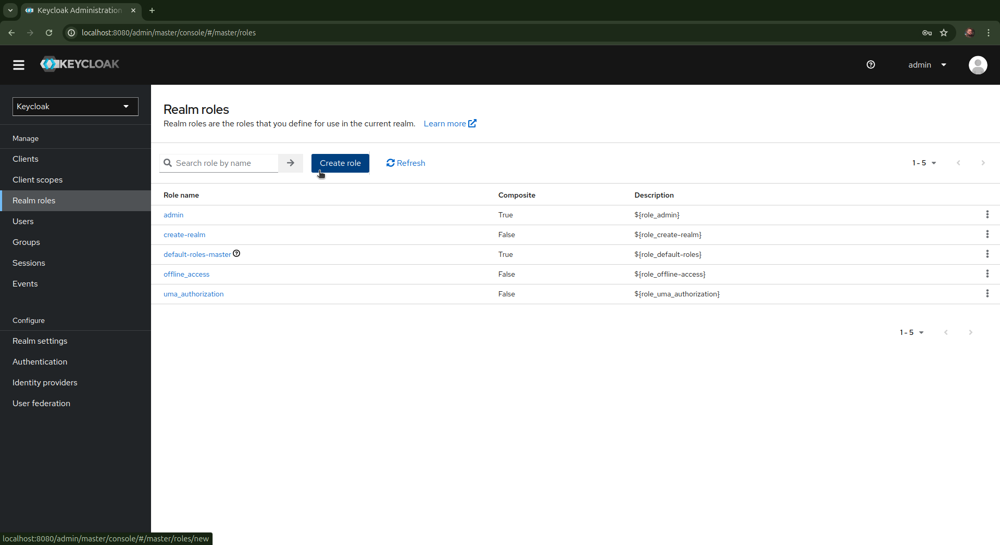
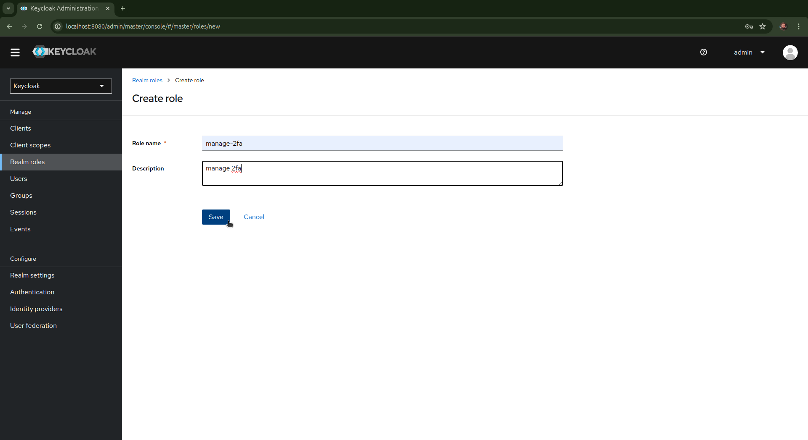
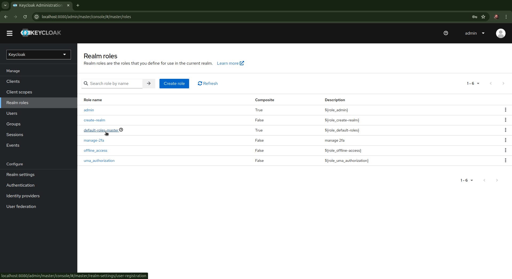
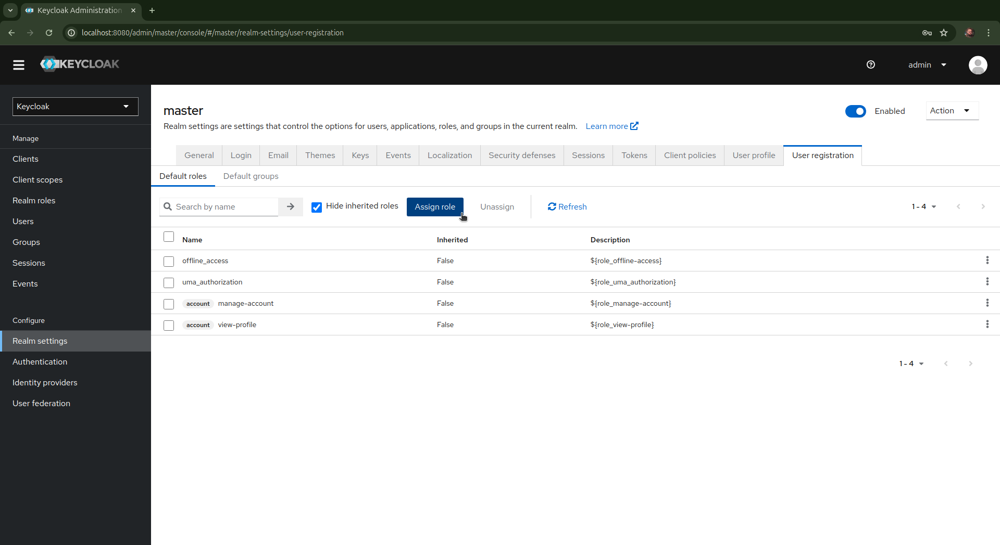
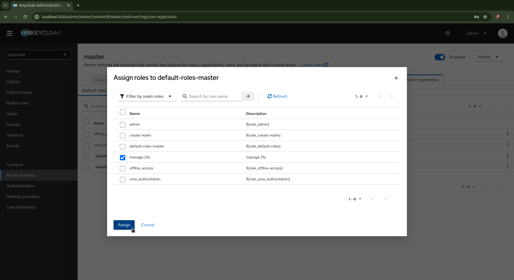

# Celero Keycloak 2FA

## Table of Contents

- [About](#about)
- [Getting Started](#getting_started)
- [Usage](#usage)
- [Contributing](../CONTRIBUTING.md)
- [References](#references)

## About <a name = "about"></a>

Celero Keycloak 2FA is a project aimed at enhancing security in applications by integrating two-factor authentication (2FA) using Keycloak and any authenticator application. This project enables users to log in using both their username/password and a one-time password (OTP) generated by authenticator apps such as Google Authenticator, Microsoft Authenticator, or Authy. It provides an extension to Keycloak for managing 2FA and endpoints for user enrollment and validation.

## Getting Started <a name = "getting_started"></a>

These instructions will help you set up a copy of the project on your local machine for development and testing purposes.

### Prerequisites

Before you begin, ensure you have the following installed on your machine:

- Docker
- Docker Compose
- Maven
- Git

### Installing

The extension is already added to keycloak and its JAR package can be found in the extensions folder of this project, for it to work just:

1. **Ensure the JAR package is in the correct folder:**

   Copy the JAR file to the Keycloak Docker container's extensions directory.

   ```bash
   migration-local/celero-keycloack/extensions/two-factor-auth-rest-api.jar
   ```

2. **Set Up Docker Compose:**
   Ensure your `docker-compose.yml` includes the following configuration:

   ```yaml
   version: '3.8'
   services:
     keycloak:
       # Your own settings for run keycloak container

       volumes:
      - ./extensions:/opt/keycloak/providers

   volumes:
    keycloak-data:
   ```

3. **Run Keycloak Using Makefile:**
   Use the Makefile to manage Docker Compose.

   - Build the container:

   ```bash
   make build
   ```

   - Run it

   ```bash
   make up
   ```

## Usage <a name = "usage"></a>

### Enabling 2FA in Keycloak

1. **Create a New Role:**
   - Go to the Keycloak Admin Console.
   - Navigate to `Roles` and create a role named `manage-2fa`.





2. **Assign the Role to Default Roles:**
   - Go to `Realm roles` and assign the `manage-2fa` role to the `default-roles-master`.








### Using the 2FA Endpoints

#### `token` Endpoint

- **Method:** POST
- **URL:** `/realms/{realm}/protocol/openid-connect/token`
- **Parameters:**
  - `user_id`: The ID of the user for whom to enable 2FA.
- **Headers:**
  - `Authorization: Bearer {access_token}`
- **Payload:**
  ```json
  {
    "client_id": "{client_id}",
    "username": "{username}",
    "password": "{password}",
    "grant_type": "password",
    "otp": "{six-digits-opt}" # use this after enable 2fa
  }
  ```
- **Response:**
  - Returns JWT Token


#### `generate-2fa` Endpoint

- **Method:** GET
- **URL:** `/realms/{realm}/two-factor-auth/manage-2fa/{user_id}/generate-2fa`
- **Headers:**
  - `Authorization: Bearer {access_token}`
- **Response:**
  - Returns encoded totp secret and a base64-encoded QR code image for Authenticator Apps.

#### `submit-2fa` Endpoint

- **Method:** POST
- **URL:** `/realms/{realm}/two-factor-auth/manage-2fa/{user_id}/submit-2fa`
- **Headers:**
  - `Authorization: Bearer {access_token}`
  - `Content-Type: application/json`
- **Payload:**
  ```json
  {
    "deviceName": "test",
    "totpInitialCode": "six-digits-opt}",
    "encodedTotpSecret": "{encodedTotpSecret}",
    "overwrite": true
  }
  ```
- **Response:**
  - Confirms the registration of the OTP.

### Example Process

1. **Generate QR Code:**
   - Get a valid user ID from Keycloak.
   - Use Postman to call the GET endpoint to generate a QR code for the user.
   - Decode the base64 QR code and scan it with an Authenticator App.

2. **Complete Registration:**
   - Call the POST endpoint with the user’s secret code and a valid 6-digit OTP from Authenticator App.
   - Validate the token to complete the registration process.

3. **Test Login:**
   - Attempt to log in with both the username/password and the OTP to ensure 2FA is working correctly.

## References <a name = "references"></a>

- [HOTP: An HMAC-Based One-Time Password Algorithm](https://datatracker.ietf.org/doc/html/rfc4226)
- [TOTP: Time-Based One-Time Password Algorithm](https://datatracker.ietf.org/doc/html/rfc6238)
- [2-Step Security for Your App: Keycloak MFA Tutorial (Spring Boot/Quarkus)](https://www.youtube.com/watch?v=RE5B30p_Tlw)
- [Keycloak 2FA Rest API Provider](https://github.com/codewithbisky/keycloak-two-factor-auth-extension/tree/develop)
